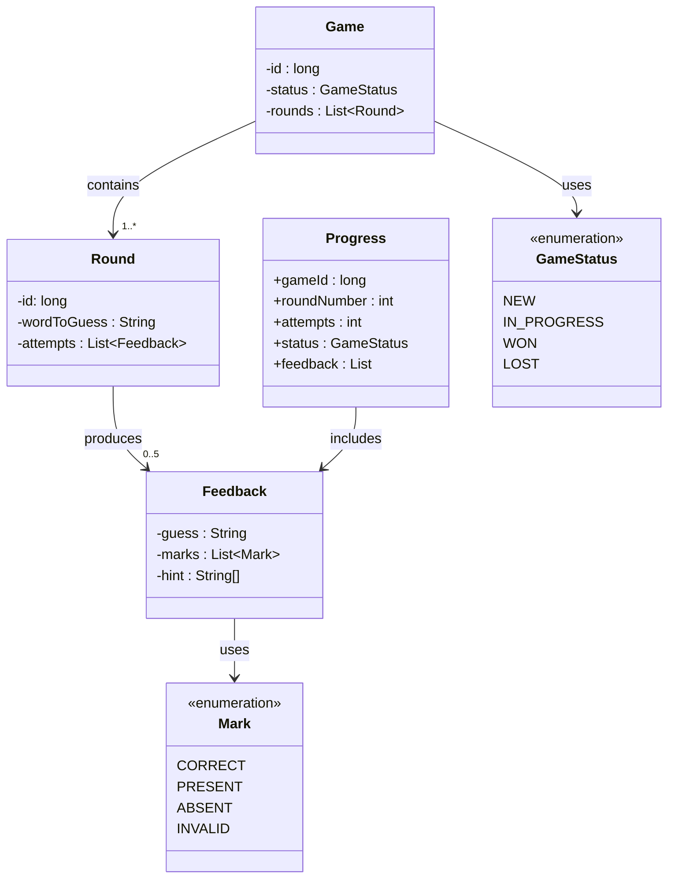

```mermaid
classDiagram
    class Game {
        -id : long
        -status : GameStatus
        -rounds : List~Round~
    }

    class Round {
        -id: long 
        -wordToGuess : String
        -attempts : List~Feedback~
        
    }

    class Feedback {
        -guess : String
        -marks : List~Mark~
        -hint : String[]
    }

    class Progress {
        +gameId : long
        +roundNumber : int
        +attempts : int
        +status : GameStatus
        +feedback : List<Feedback>
    }

    class GameStatus {
        <<enumeration>>
        NEW
        IN_PROGRESS
        WON
        LOST
    }

    class Mark {
        <<enumeration>>
        CORRECT
        PRESENT
        ABSENT
        INVALID
    }

%% Relationships
    Game --> "1..*" Round : contains
    Round --> "0..5" Feedback : produces
    Progress --> Feedback : includes
    Game --> GameStatus : uses
    Feedback --> Mark : uses
```